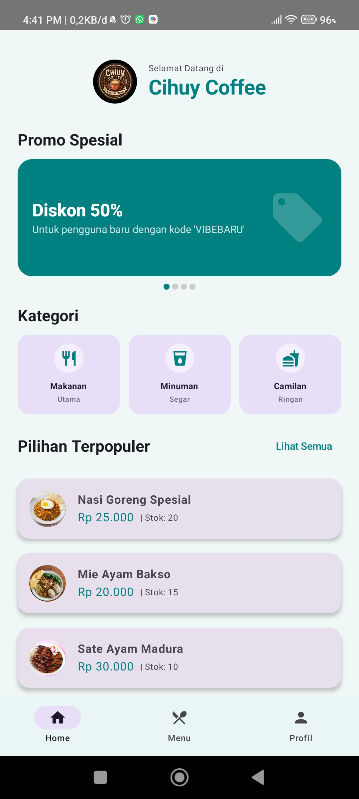
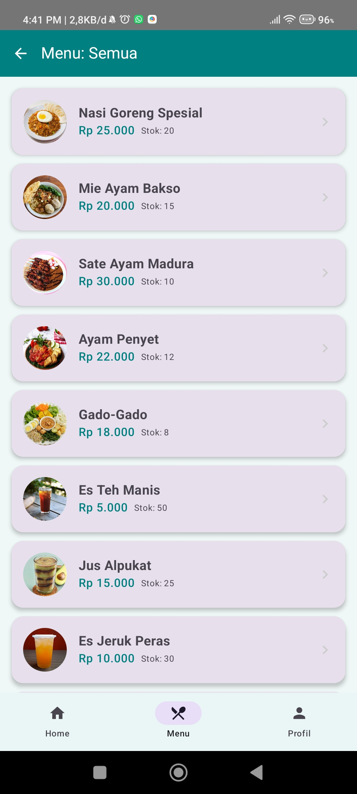
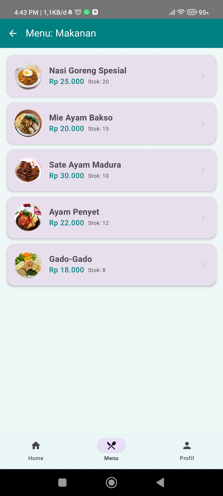
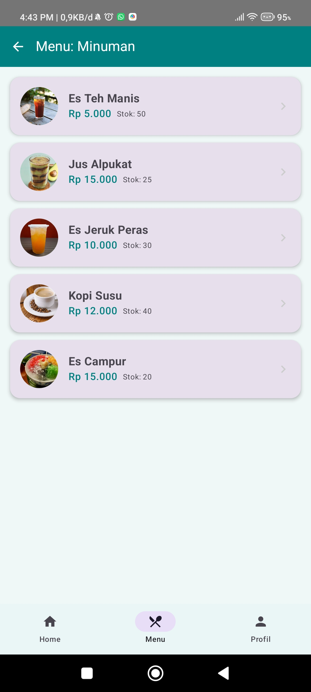
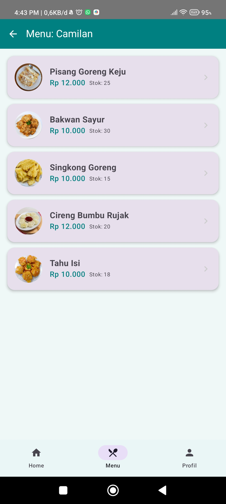
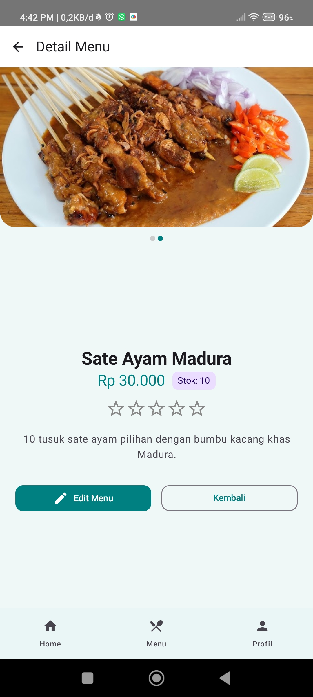
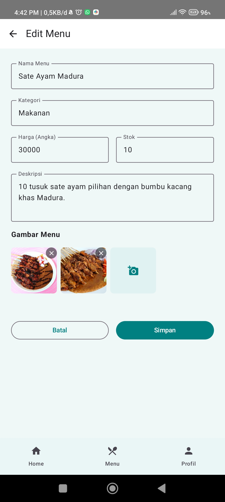
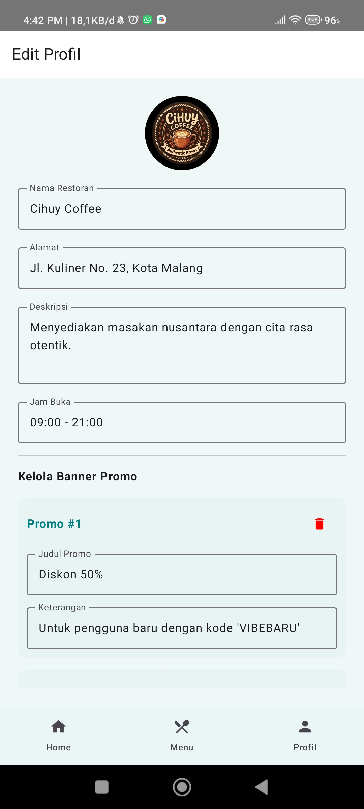
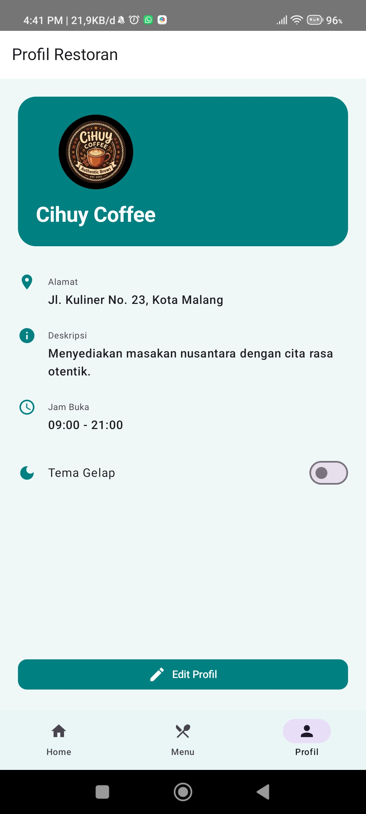

# Restoran Menu - Katalog & Manajemen Menu Digital

Aplikasi katalog menu restoran modern yang dibangun menggunakan **Jetpack Compose**. Aplikasi ini dirancang untuk memudahkan pengelola restoran dalam memamerkan menu mereka dan mengelola data ketersediaan stok secara digital.

## Fitur Utama

- **Home Screen Interaktif**: Dilengkapi dengan banner promo yang bisa diubah-ubah, logo restoran, dan kategori menu cepat.
- **Katalog Menu Lengkap**: Daftar menu yang terbagi berdasarkan kategori (Makanan, Minuman, Camilan) dengan pencarian kategori yang mudah.
- **Manajemen Stok**: Admin dapat melihat dan memperbarui jumlah stok setiap menu secara real-time.
- **Profil Kustom**: Ubah nama restoran, alamat, jam buka, dan upload logo restoran Anda sendiri.
- **Promo Banner Dinamis**: Kelola penawaran spesial langsung dari dalam aplikasi (Admin dapat menambah/hapus promo).
- **Multi-Image Slideshow**: Unggah beberapa foto untuk setiap menu guna memberikan tampilan yang lebih menggugah selera.
- **Mode Gelap/Terang**: Dukungan tema gelap yang nyaman di mata dengan palet warna Tosca yang disesuaikan.

## Screenshot Aplikasi

### Halaman Utama & Katalog
| Home Screen | Daftar Menu (Semua) |
|:---:|:---:|
|  |  |
| *Halaman penyambutan dengan logo, promo, dan kategori.* | *Daftar menu lengkap dengan indikator stok.* |

### Filter Kategori
| Makanan | Minuman | Camilan |
|:---:|:---:|:---:|
|  |  |  |
| *Menu khusus kategori Makanan.* | *Menu khusus kategori Minuman.* | *Menu khusus kategori Camilan.* |

### Detail & Pengaturan
| Detail Menu | Edit Menu | Edit Profil |
|:---:|:---:|:---:|
|  |  |  |
| *Tampilan detail menu (Slideshow).* | *Formulir edit data menu & stok.* | *Pusat kendali restoran & promo.* |

| Profil Restoran |
|:---:|
|  |
| *Informasi lengkap & toggle tema.* |

## Penjelasan Teknis

### 1. Arsitektur & Teknologi
- **Bahasa**: Kotlin
- **UI Framework**: Jetpack Compose (Material 3)
- **Image Loading**: Coil untuk pemrosesan gambar lokal dan galeri.
- **Navigation**: Jetpack Navigation untuk transisi antar layar.
- **Storage**: SharedPreferences (dengan format JSON) untuk data profil, promo, dan preferensi tema.

### 2. UI/UX Modern
- **Theme-Aware**: Warna semantik yang otomatis menyesuaikan mode terang/gelap.
- **Full Width Image**: Tampilan detail menu menggunakan rasio lebar untuk kesan premium.
- **Interactive Forms**: Validasi input sederhana dan layout terstruktur untuk admin.

## Cara Instalasi
1. Clone repository ini.
2. Buka di **Android Studio Iguana** atau versi yang lebih baru.
3. Hubungkan perangkat Android atau gunakan Emulator (Min SDK 24).
4. Jalankan aplikasi melalui tombol **Run**.

---
*Dibuat untuk tugas Pemrograman Mobile (UTS) - Menu Restoran UTS*
